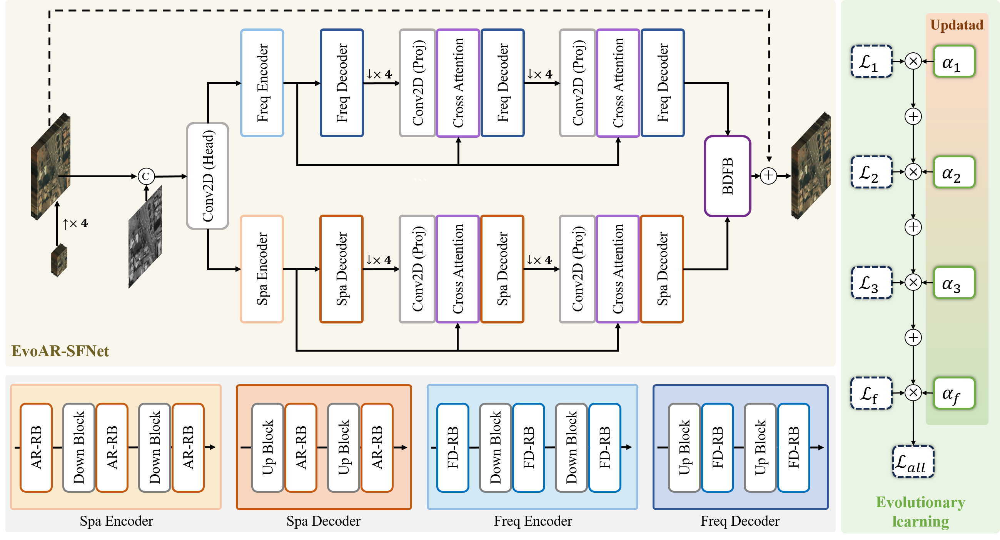

<div align="center">

# EvoAR-SFNet: Evolutionary Autoregressive Spatial-Frequency Network for Remote Sensing Pansharpening

</div>

PyTorch implementation of the paper "EvoAR-SFNet: Evolutionary Autoregressive Spatial-Frequency Network for Remote Sensing Pansharpening". The manuscript is currently under review.

## Introduction



- EvoAR-SFNet uses a spatial-frequency dual-stream architecture built on `ARConv` and `FDConv`.
- The EvoAR design progressively refines multi-stage predictions through autoregressive feedback.
- An evolutionary loss-weight strategy is used during training to balance stage-wise supervision.
- The codebase also contains several scripts for ablation, feature analysis, downstream qualitative analysis, and speed profiling.

## Installation

### Prerequisites

The project was tested on Ubuntu 20.04 with:

- Python >= 3.10
- PyTorch >= 2.1
- CUDA
- Other dependencies in `requirements.txt`

### Clone this repository

```bash
git clone <repo_url>
cd EvoAR-SFNet
```

### Create a conda environment

```bash
conda create -n EvoARFS python=3.10 -y
conda activate EvoARFS
```

### Install dependencies

```bash
pip install torch==2.1.1+cu118 torchvision==0.16.1+cu118 --index-url https://download.pytorch.org/whl/cu118
pip install -r requirements.txt
```

Optional dependencies used by analysis scripts:

```bash
pip install thop
pip install git+https://github.com/facebookresearch/segment-anything.git
```

Notes:

- `thop` is required by `testSpeed.py` and `testSpeedEvoARSF.py`.
- `segment-anything` plus a downloaded SAM checkpoint is required by `analyzeDownstreamSeg.py`.

## Data Preparation

This project uses the `PanCollection` datasets for `WV3`, `QB`, and `GF2`.

Dataset link: [PanCollection Official Website](https://liangjiandeng.github.io/PanCollection.html)

Expected directory structure:

```text
EvoAR-SFNet/
|-- pansharpening/
|   |-- training_data/
|   |   |-- train_gf2.h5
|   |   |-- train_qb.h5
|   |   `-- train_wv3.h5
|   |-- validation_data/
|   |   |-- valid_gf2.h5
|   |   |-- valid_qb.h5
|   |   `-- valid_wv3.h5
|   `-- test_data/
|       |-- GF2/
|       |   |-- test_gf2_multiExm1.h5
|       |   `-- test_gf2_OrigScale_multiExm1.h5
|       |-- QB/
|       |   |-- test_qb_multiExm1.h5
|       |   `-- test_qb_OrigScale_multiExm1.h5
|       `-- WV3/
|           |-- test_wv3_multiExm1.h5
|           `-- test_wv3_OrigScale_multiExm1.h5
`-- ...
```

If your dataset is stored elsewhere, create a soft link:

```bash
cd $EvoARFS_ROOT
ln -s /path/to/pansharpening pansharpening
```

## Getting Started

### 1. Train the full model

```bash
python trainerEvoARFSNet.py \
  --batch_size 16 \
  --epochs 560 \
  --lr 0.0006 \
  --ckpt 10 \
  --train_set_path ./pansharpening/training_data/train_wv3.h5 \
  --val_set_path ./pansharpening/validation_data/valid_wv3.h5 \
  --checkpoint_save_path ./workdir/EvoARFSNet_wv3 \
  --task wv3 \
  --fusion_type implicit \
  --num_refine 2 \
  --hw_range 1 18
```

Important training arguments:

| Argument | Meaning |
| :-- | :-- |
| `--task` | Dataset type: `wv3`, `qb`, `gf2` |
| `--fusion_type` | Fusion mode: `add`, `concat`, `explicit`, `implicit` |
| `--num_refine` | Number of autoregressive refinement steps: `1`, `2`, `3` |
| `--hw_range` | ARConv range; keep this consistent between training and inference |
| `--checkpoint_path` | Resume training from an existing checkpoint |
| `--checkpoint_save_path` | Directory for checkpoints, copied code snapshot, and `loss.txt` |

### 2. Export `.mat` results for evaluation

Reduced-resolution test set:

```bash
python getReducedmat.py \
  --ckpath ./pth/checkpoint_wv3.pth \
  --test_data_path ./pansharpening/test_data/WV3/test_wv3_multiExm1.h5 \
  --save_dir ./2_DL_Result/PanCollection/WV3_Reduced/EvoARFS/results/ \
  --task wv3 \
  --fusion_type implicit \
  --num_refine 2 \
  --hw_range 1 18
```

Full-resolution test set:

```bash
python getFullmat.py \
  --ckpath ./pth/checkpoint_wv3.pth \
  --test_data_path ./pansharpening/test_data/WV3/test_wv3_OrigScale_multiExm1.h5 \
  --save_dir ./2_DL_Result/PanCollection/WV3_Full/EvoARFS/results/ \
  --task wv3 \
  --fusion_type implicit \
  --num_refine 2 \
  --hw_range 1 18
```

Generated files are saved as:

```text
output_mulExm_0.mat
output_mulExm_1.mat
...
```

Each `.mat` file contains the key `sr`.

### 3. MATLAB evaluation

After exporting `.mat` files, evaluate them using the PanCollection / MATLAB evaluation pipeline.

Reference implementation: [AFAR-Net](https://github.com/xiongxiong1996/AFAR-Net)

## Ablation and Analysis

### 1. Fusion strategy ablation

Use `--fusion_type` in both training and inference/export scripts:

- `implicit`: proposed fusion branch in this repo
- `explicit`: gated fusion
- `concat`: concatenate then `1x1` fuse
- `add`: direct element-wise addition

Example:

```bash
python trainerEvoARFSNet.py \
  --batch_size 16 \
  --epochs 560 \
  --lr 0.0006 \
  --ckpt 10 \
  --train_set_path ./pansharpening/training_data/train_wv3.h5 \
  --val_set_path ./pansharpening/validation_data/valid_wv3.h5 \
  --checkpoint_save_path ./workdir/ablation_concat_wv3 \
  --task wv3 \
  --fusion_type concat \
  --num_refine 2 \
  --hw_range 1 18
```

When exporting results from an ablation checkpoint, pass the same `--fusion_type`.

### 2. Autoregressive refinement depth ablation

Use `--num_refine` to compare different refinement depths:

- `--num_refine 1`
- `--num_refine 2`
- `--num_refine 3`

Example:

```bash
python trainerEvoARFSNet.py \
  --batch_size 16 \
  --epochs 560 \
  --lr 0.0006 \
  --ckpt 10 \
  --train_set_path ./pansharpening/training_data/train_wv3.h5 \
  --val_set_path ./pansharpening/validation_data/valid_wv3.h5 \
  --checkpoint_save_path ./workdir/ablation_refine1_wv3 \
  --task wv3 \
  --fusion_type implicit \
  --num_refine 1 \
  --hw_range 1 18
```

When exporting, profiling, or analyzing that checkpoint, pass the same `--num_refine`.

### 3. Dual-branch feature analysis

`analyzeDualFeatures.py` is useful for visualizing and quantifying the spatial / frequency branches.

Example:

```bash
python analyzeDualFeatures.py \
  --ckpath ./pth/checkpoint_wv3.pth \
  --test_data_path ./pansharpening/test_data/WV3/test_wv3_multiExm1.h5 \
  --save_dir ./analysis/dual_features_wv3 \
  --task wv3 \
  --fusion_type implicit \
  --num_refine 2 \
  --hw_range 1 18 \
  --indices 0 5 10
```

Main outputs:

- `sample_xxx/ar_mean_map.png`
- `sample_xxx/fd_mean_map.png`
- `sample_xxx/fused_mean_map.png`
- `sample_xxx/ar_fft_map.png`
- `sample_xxx/fd_fft_map.png`
- `sample_xxx/fused_fft_map.png`
- `sample_xxx/ar_top_channels.png`
- `sample_xxx/fd_top_channels.png`
- `sample_xxx/branch_pca.png`
- `sample_xxx/similarity_bar.png`
- `feature_stats.csv`
- `feature_summary.txt`

### 4. SAM-based downstream qualitative analysis

`analyzeDownstreamSeg.py` uses the exported `.mat` results together with the original H5 test data and runs SAM-based automatic segmentation for a downstream-oriented qualitative comparison.

Recommended workflow:

1. Export `.mat` results with `getReducedmat.py` or `getFullmat.py`.
2. Install `segment-anything`.
3. Download a SAM checkpoint such as `sam_vit_h_4b8939.pth`.
4. Run the analysis script.

Example:

```bash
python analyzeDownstreamSeg.py \
  --pan_root ./2_DL_Result/PanCollection \
  --h5_root ./pansharpening/test_data \
  --save_dir ./analysis/downstream_seg \
  --sam_checkpoint /path/to/sam_vit_h_4b8939.pth \
  --sam_model_type vit_h \
  --collections WV3_Reduced QB_Reduced GF2_Reduced \
  --topk_candidates 8
```

Notes:

- If `--collections` is omitted, the script processes reduced-resolution collections by default.
- Add `--include_full` if you also want `*_Full` collections.
- The script automatically searches for a `results/` folder under each PanCollection result directory.

Main outputs:

- Per-collection `sam_metrics.csv`
- Per-collection `candidate_ranking.csv`
- Per-collection `sam_summary.txt`
- Global `global_sam_metrics.csv`
- Global `global_candidate_ranking.csv`
- Per-sample overview figures such as `overview.png`, `boundary_triplet.png`, `sam_overlay_triplet.png`

### 5. Speed / efficiency analysis

Use `testSpeed.py` for timing, FLOPs, params, and memory statistics.

```bash
python testSpeed.py \
  --ckpath ./pth/checkpoint_wv3.pth \
  --test_data_path ./pansharpening/test_data/WV3/test_wv3_OrigScale_multiExm1.h5 \
  --task wv3 \
  --fusion_type implicit \
  --num_refine 2 \
  --hw_range 1 18 \
  --sample_idx 0 \
  --warmup_runs 50 \
  --test_runs 200 \
  --save_name EvoARFSNet_wv3
```

Outputs:

- `speed_analysis/<save_name>/<task>_samplexxx.json`
- `speed_analysis/speed_summary.csv`

`testSpeedEvoARSF.py` currently uses the same interface and can be used in the same way if you want to keep separate profiling records.

## Results

We report both qualitative and quantitative comparisons on `WV3`, `QB`, and `GF2`.

**Visual comparison on reduced-resolution data**


**Visual comparison on full-resolution data**


**Performance on the WV3 dataset (Mean +/- Std). Best in bold, second-best in italics**

| Method | SAM | ERGAS | Q | D_lambda | D_s | QNR |
| :--: | :--: | :--: | :--: | :--: | :--: | :--: |
| BDSD-PC(2019)[32] | 5.429+/-1.823 | 4.698+/-1.617 | 0.829+/-0.097 | 0.0625+/-0.0235 | 0.0730+/-0.0356 | 0.870+/-0.053 |
| CVPR19(2019)[35] | 5.207+/-1.574 | 5.484+/-1.505 | 0.764+/-0.088 | 0.0297+/-0.0059 | 0.0410+/-0.0136 | 0.931+/-0.018 |
| LRTCFPan(2023)[36] | 4.737+/-1.412 | 4.315+/-1.442 | 0.846+/-0.091 | 0.0176+/-0.0066 | 0.0528+/-0.0258 | 0.931+/-0.031 |
| DiCNN(2018)[24] | 3.593+/-0.762 | 2.673+/-0.663 | 0.900+/-0.087 | 0.0362+/-0.0111 | 0.0462+/-0.0175 | 0.920+/-0.026 |
| FusionNet(2021)[40] | 3.325+/-0.698 | 2.467+/-0.645 | 0.904+/-0.090 | 0.0239+/-0.0090 | 0.0364+/-0.0137 | 0.941+/-0.020 |
| DCFNet(2021)[25] | 3.038+/-0.585 | 2.165+/-0.499 | 0.913+/-0.087 | 0.0187+/-0.0072 | 0.0337+/-0.0054 | 0.948+/-0.012 |
| LAGConv(2022)[27] | 3.104+/-0.559 | 2.300+/-0.613 | 0.910+/-0.091 | 0.0368+/-0.0148 | 0.0418+/-0.0152 | 0.923+/-0.025 |
| HMPNet(2023)[41] | 3.063+/-0.577 | 2.229+/-0.545 | 0.916+/-0.087 | 0.0184+/-0.0073 | 0.0530+/-0.0555 | 0.930+/-0.011 |
| CMT(2024)[26] | 2.994+/-0.607 | 2.214+/-0.516 | 0.917+/-0.085 | 0.0207+/-0.0082 | 0.0370+/-0.0078 | 0.943+/-0.014 |
| CANNet(2024)[44] | 2.930+/-0.593 | 2.158+/-0.515 | 0.920+/-0.084 | 0.0196+/-0.0083 | 0.0301+/-0.0074 | 0.951+/-0.013 |
| ARConv(2025)[28] | _2.885+/-0.590_ | _2.139+/-0.528_ | **0.921+/-0.083** | **0.0146+/-0.0059** | _0.0279+/-0.0068_ | _0.958+/-0.010_ |
| EvoAR-SFNet(Ours) | **2.877+/-0.591** | **2.119+/-0.527** | **0.922+/-0.084** | _0.0151+/-0.0059_ | **0.0274+/-0.0040** | **0.958+/-0.008** |

**Performance on the QB dataset (Mean +/- Std). Best in bold, second-best in italics**

| Method | SAM | ERGAS | Q | D_lambda | D_s | QNR |
| :--: | :--: | :--: | :--: | :--: | :--: | :--: |
| BDSD-PC(2019)[32] | 8.089+/-1.980 | 7.515+/-0.800 | 0.831+/-0.090 | 0.1975+/-0.0334 | 0.1636+/-0.0483 | 0.672+/-0.058 |
| CVPR19(2019)[35] | 7.998+/-0.820 | 9.359+/-1.268 | 0.737+/-0.087 | 0.0498+/-0.0119 | 0.0783+/-0.0170 | 0.876+/-0.023 |
| LRTCFPan(2023)[36] | 7.187+/-1.711 | 6.928+/-0.812 | 0.855+/-0.087 | **0.0226+/-0.0117** | 0.0705+/-0.0351 | 0.909+/-0.044 |
| DiCNN(2018)[24] | 5.380+/-1.027 | 5.135+/-0.488 | 0.904+/-0.094 | 0.0947+/-0.0145 | 0.1067+/-0.0210 | 0.809+/-0.031 |
| FusionNet(2021)[40] | 4.923+/-0.908 | 4.159+/-0.321 | 0.925+/-0.090 | 0.0572+/-0.0182 | 0.0522+/-0.0088 | 0.894+/-0.021 |
| DCFNet(2021)[25] | 4.512+/-0.773 | 3.809+/-0.336 | 0.934+/-0.087 | 0.0469+/-0.0150 | 0.1239+/-0.0269 | 0.835+/-0.016 |
| LAGConv(2022)[27] | 4.547+/-0.830 | 3.826+/-0.420 | 0.934+/-0.088 | 0.0859+/-0.0237 | 0.0676+/-0.0136 | 0.852+/-0.018 |
| HMPNet(2023)[41] | 4.617+/-0.404 | **3.404+/-0.478** | 0.936+/-0.102 | 0.1832+/-0.0542 | 0.0793+/-0.0245 | 0.753+/-0.065 |
| CMT(2024)[26] | 4.535+/-0.822 | 3.744+/-0.321 | 0.935+/-0.086 | 0.0504+/-0.0122 | _0.0368+/-0.0075_ | 0.915+/-0.016 |
| CANNet(2024)[44] | 4.507+/-0.835 | 3.652+/-0.327 | 0.937+/-0.083 | _0.0370+/-0.0129_ | 0.0499+/-0.0092 | 0.915+/-0.012 |
| ARConv(2025)[28] | **4.430+/-0.811** | 3.633+/-0.327 | **0.939+/-0.081** | 0.0384+/-0.0148 | 0.0396+/-0.0090 | _0.924+/-0.019_ |
| EvoAR-SFNet(Ours) | _4.470+/-0.831_ | _3.603+/-0.334_ | _0.939+/-0.082_ | 0.0413+/-0.0122 | **0.0319+/-0.0186** | **0.928+/-0.028** |

**Performance on the GF2 dataset (Mean +/- Std). Best in bold, second-best in italics**

| Method | SAM | ERGAS | Q | D_lambda | D_s | QNR |
| :--: | :--: | :--: | :--: | :--: | :--: | :--: |
| BDSD-PC(2019)[32] | 1.681+/-0.360 | 1.667+/-0.445 | 0.892+/-0.035 | 0.0759+/-0.0301 | 0.1548+/-0.0280 | 0.781+/-0.041 |
| CVPR19(2019)[35] | 1.598+/-0.353 | 1.877+/-0.448 | 0.886+/-0.028 | 0.0307+/-0.0127 | 0.0622+/-0.0101 | 0.909+/-0.017 |
| LRTCFPan(2023)[36] | 1.315+/-0.283 | 1.301+/-0.313 | 0.932+/-0.033 | 0.0325+/-0.0269 | 0.0896+/-0.0141 | 0.881+/-0.023 |
| DiCNN(2018)[24] | 1.053+/-0.231 | 1.081+/-0.254 | 0.959+/-0.010 | 0.0369+/-0.0132 | 0.0992+/-0.0131 | 0.868+/-0.016 |
| FusionNet(2021)[40] | 0.974+/-0.212 | 0.988+/-0.222 | 0.964+/-0.009 | 0.0350+/-0.0124 | 0.1013+/-0.0134 | 0.867+/-0.018 |
| DCFNet(2021)[25] | 0.872+/-0.169 | 0.784+/-0.146 | 0.974+/-0.009 | 0.0240+/-0.0115 | 0.0659+/-0.0096 | 0.912+/-0.012 |
| LAGConv(2022)[27] | 0.786+/-0.148 | 0.687+/-0.113 | 0.981+/-0.008 | 0.0284+/-0.0130 | 0.0792+/-0.0136 | 0.895+/-0.020 |
| HMPNet(2023)[41] | 0.803+/-0.141 | **0.564+/-0.099** | 0.981+/-0.020 | 0.0819+/-0.0499 | 0.1146+/-0.0126 | 0.813+/-0.049 |
| CMT(2024)[26] | 0.753+/-0.138 | 0.648+/-0.109 | 0.982+/-0.007 | 0.0225+/-0.0116 | _0.0433+/-0.0096_ | _0.935+/-0.014_ |
| CANNet(2024)[44] | _0.707+/-0.148_ | 0.630+/-0.128 | _0.983+/-0.006_ | 0.0194+/-0.0101 | 0.0630+/-0.0094 | 0.919+/-0.011 |
| ARConv(2025)[28] | **0.698+/-0.149** | _0.626+/-0.127_ | **0.983+/-0.007** | _0.0189+/-0.0097_ | 0.0515+/-0.0099 | 0.931+/-0.012 |
| EvoAR-SFNet(Ours) | 0.845+/-0.168 | 0.772+/-0.141 | 0.977+/-0.008 | **0.0188+/-0.0102** | **0.0366+/-0.0110** | **0.945+/-0.011** |

## Citation

If this project is helpful to your work, please consider citing the paper after publication:

```bibtex
@article{evoar_sfnet,
  title   = {EvoAR-SFNet: Evolutionary Autoregressive Spatial-Frequency Network for Remote Sensing Pansharpening},
  author  = {Shaohua Duan, Chunjie Zhang, Xiaolong Zheng, Yao Zhao},
  journal = {IEEE Journal of Selected Topics in Applied Earth Observations and Remote Sensing},
  year    = {2026}
  DOI    = {10.1109/JSTARS.2026.3694553}
}
```
